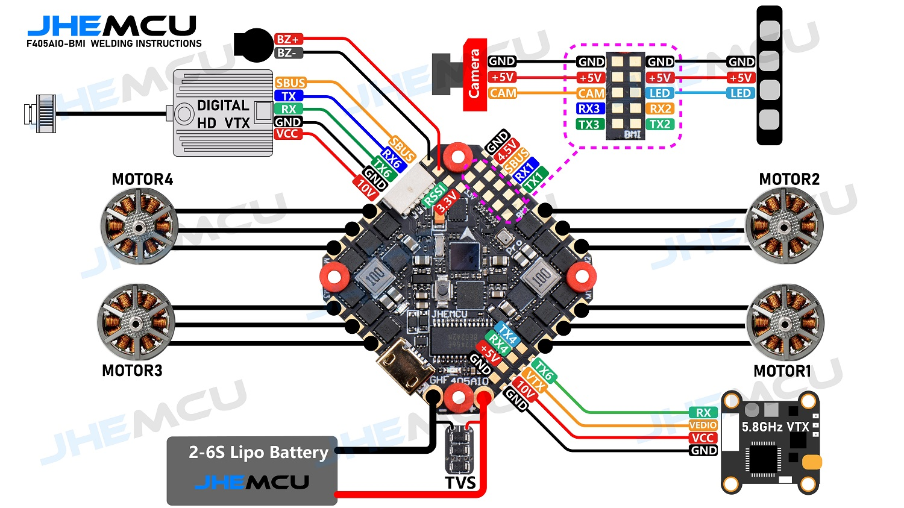

# Documentações e manuais sobre a montagem do drone de 3 polegadas

## Ligações da controladora
[1(#)

## Ligações da receptor
[1(#)

[Documentações do VTX](https://github.com/edilsoncorrea/drone3inch/blob/main/vtx/README.md)

[Documentação dos motores](https://github.com/edilsoncorrea/drone3inch/blob/main/motor/README.md)

[Documentação do receptor](https://github.com/edilsoncorrea/drone3inch/blob/main/receptor/README.md)

[Documentação da câmera Caddx](https://github.com/edilsoncorrea/drone3inch/blob/main/camera/README.md)

[Documentação do frame](https://github.com/edilsoncorrea/drone3inch/blob/main/frame/README.md)

[Documentação da flight controller](https://github.com/edilsoncorrea/drone3inch/blob/main/flightcontroller/README.md)

