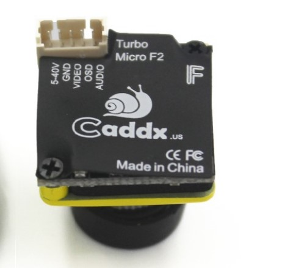

# CADDX Turbo Micro F2 1/3" CMOS 2.1mm 1200TVL FPV Camera 16:9/4:3 NTSC/PAL with Microphone Low Latency 4.5g Micro Camera VS F1

[1(#)

[1(#)

[1(#)

## Feature:
1. Image sensor: 1/3" CMOS sensor
2. Horizontal: 1200TVL
3. TV system: NTSC/PAL,changeable
4. Power Input: 4.5-40V
5. Mini Illumination: 0.001lux
6. Dimension: 19*19*19mm
7. Net weight: 5.5g
8. Lens: 2.1mm
9. Color: Yellow/Green/Pink/Black
10. Aspect Ratio: 16:9 4:3 non-changeable
11. Add microphone
 

### The difference with F1: has microphone
