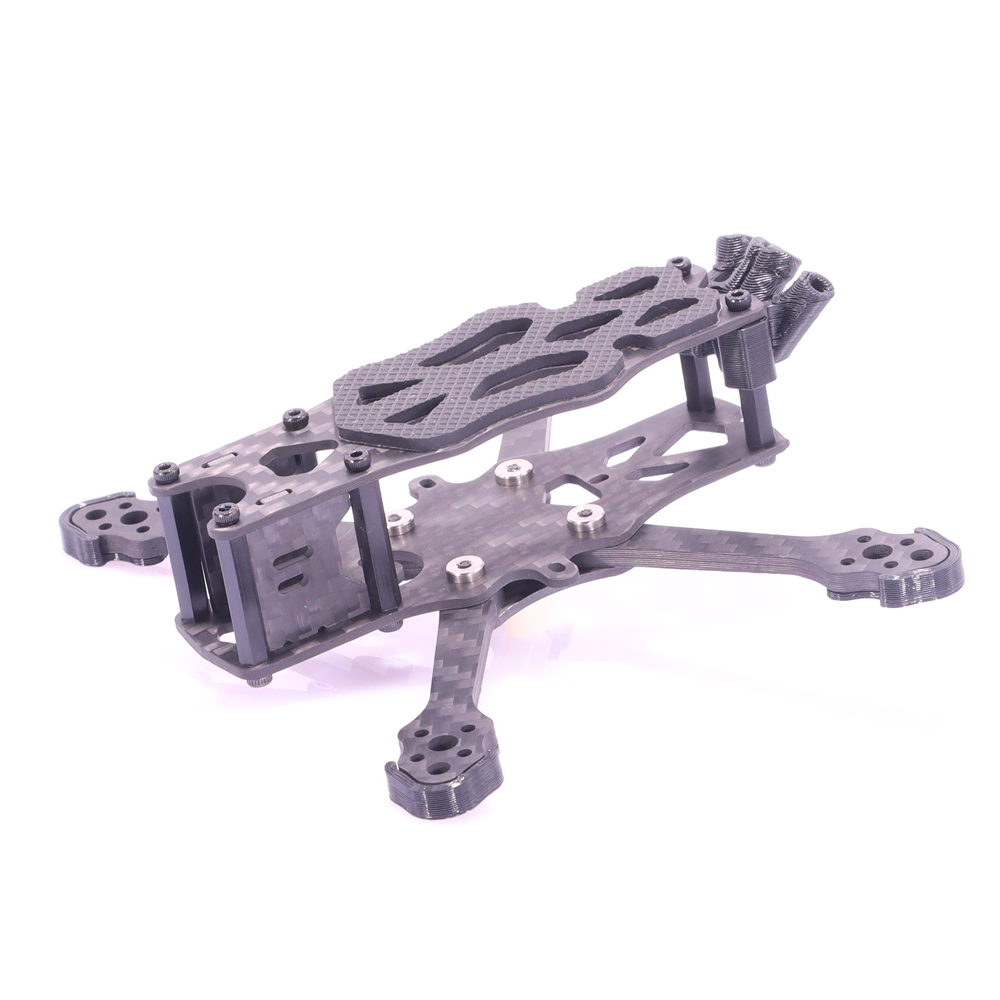
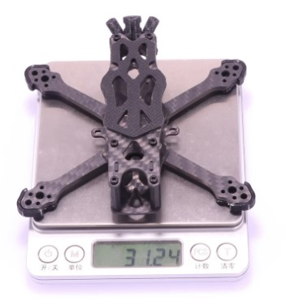
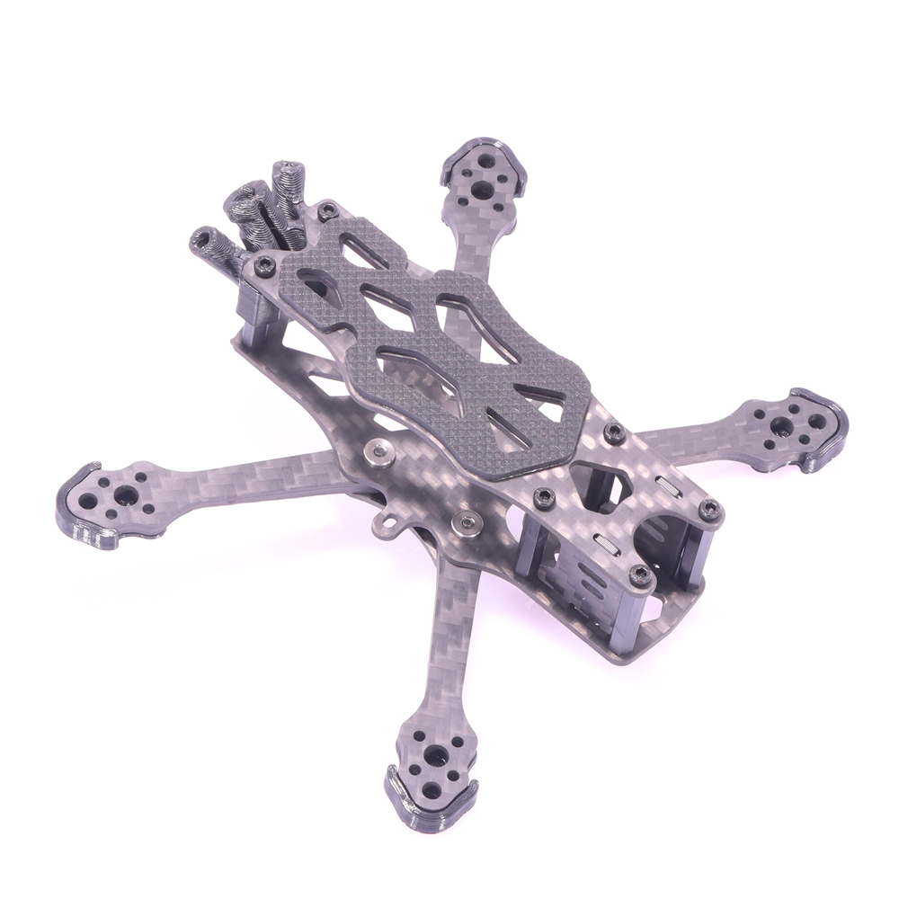
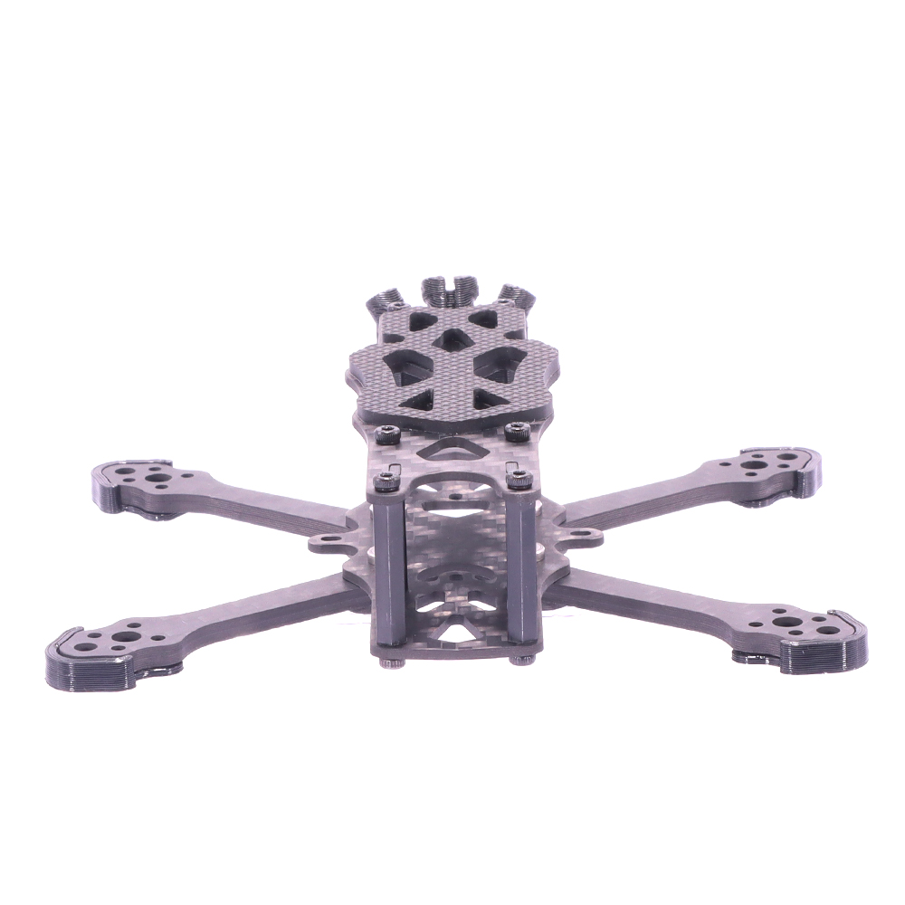
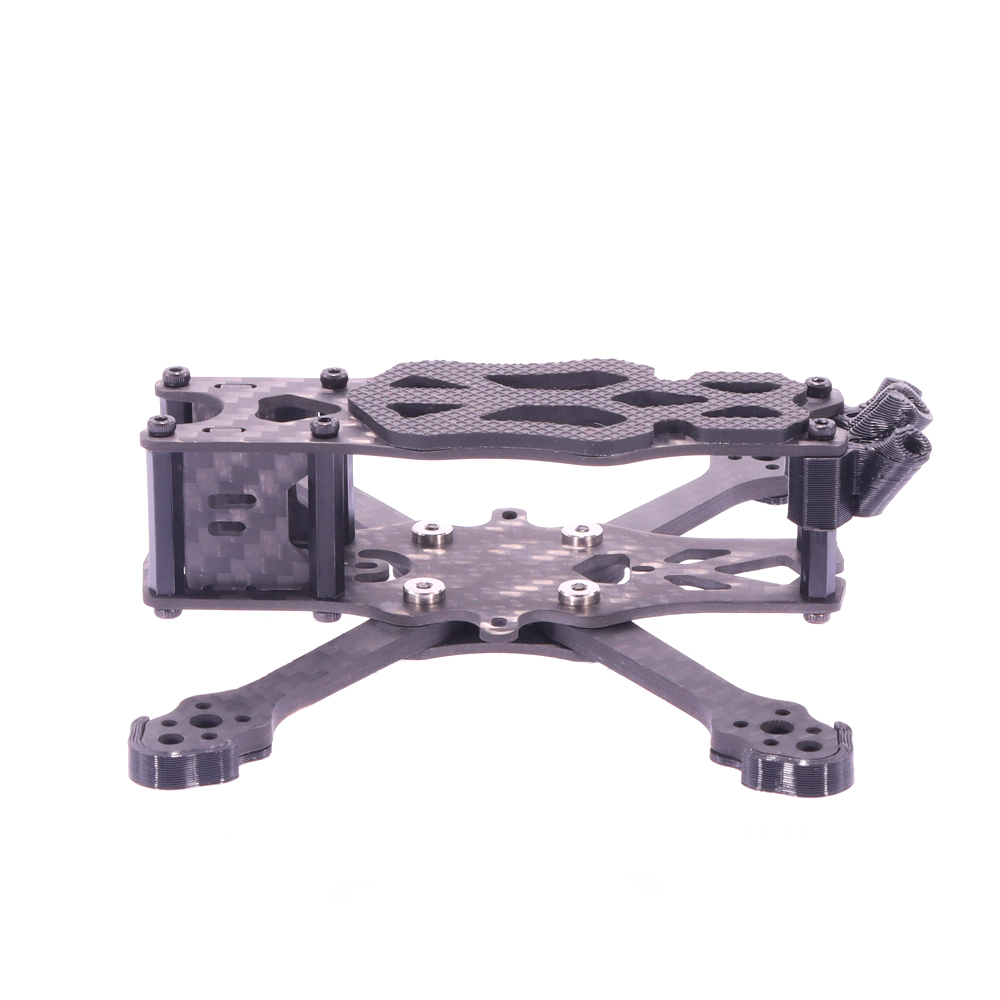

# Baby APEX 2.5/3inch Frame Kit RC Drone FPV Racing Quadcopter support Caddx Polar/Nebula Nano 1103 1104 1106 1204 Brushless Motor

[1(#)

## Specification:
Brand Name: AlfaRC.
Model: Baby APEX.
Wheelbase: 115mm(2.5 inch)/132mm(3 inch).
Arm Thickness: 3MM.
Other plates: 1.5mm.
Column height:20mm.
Weight: 31g/2.5 inch(Different production batches will vary ).
Material: 3K Carbon Fiber.

## Recommend Parts:
Flight Controller: Tower System/Kiss/F4/F7(Hole distance:20*20mm/25.5*25.5/26.5*26.5).
Motor: 11XX/12XX...Brushless Motor(Hole distance:9*9mm).
ESC: 10-100A Brushless ESC.
Propeller: 115(2.5 inch)/132(3 inch).
Battery: 2/6S Lipo Battery.
Support camera: Nano series FPV camera/14MM.

[1(#)

[1(#)

[1(#)

[1(#)
