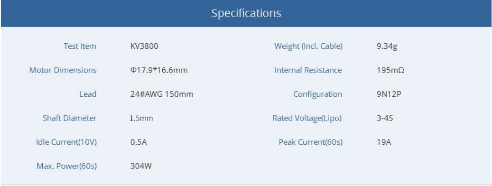
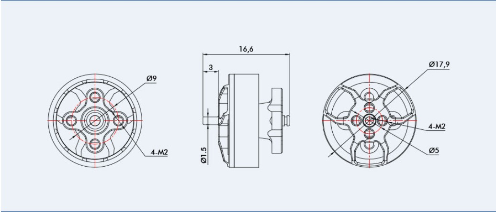
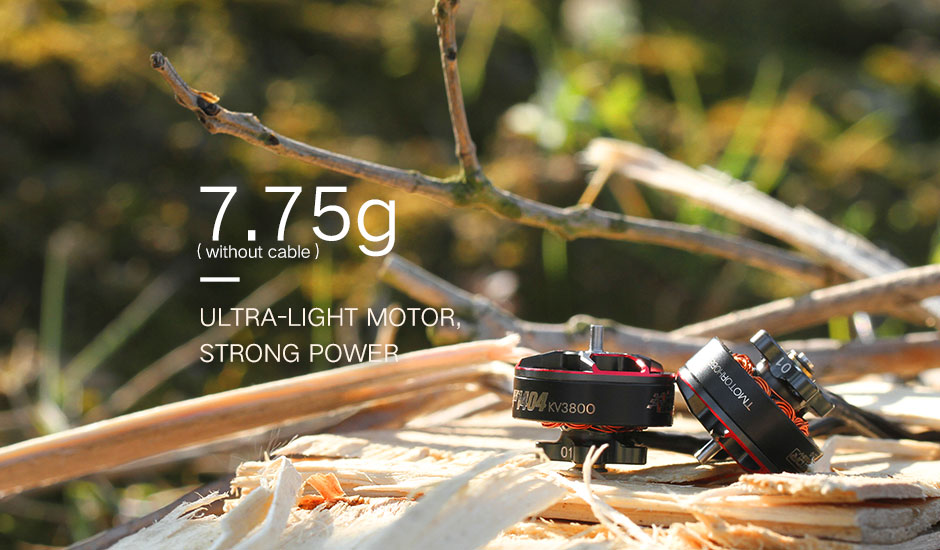
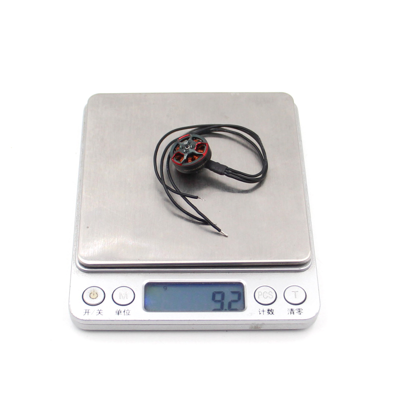
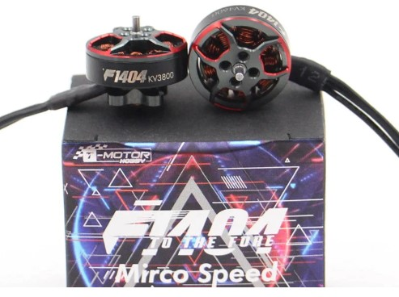

# Motor F1404 3800KV

Item Name: T-motor F1404 3800KV 4600KV Brushless Motor

Product Parameters:

Brand: T-motor

Item Name: F1404

KV: 3800/4600KV

Motor Dimensions: $17.9x16.6mm

Lead: 24#AWG 150mm

Shaft Diameter: 1.5mm

Idle Current(10V): 0.5A (3800KV), 0.6A (4600KV)

Peak current (60S): 19A(3800KV), 20A(4600KV)

Weight (Inc. Cable): 9.34g

Internal Resistance: 195m (3800KV), 138m (4600KVV)

Rated Voltage (Lipo): 3-4S

Mounting: 9x9mm/M2

[1(#)

[1(#)

[1(#)

[1(#)

[1(#)
