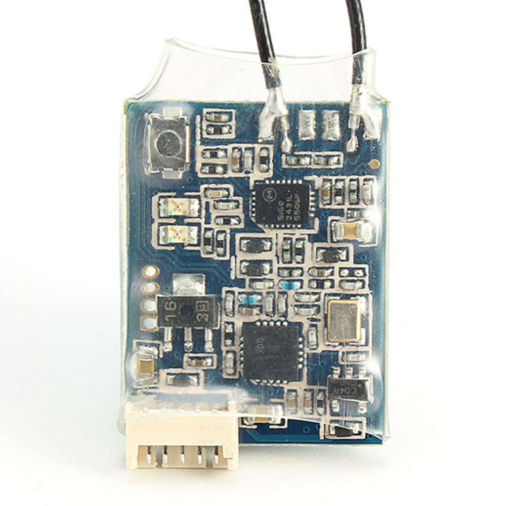

# FrSky XSR 2.4GHz 16CH ACCST Receiver Receptor W/ S-Bus CPPM for for X9D X9E X9DP X12S X7 X-lite Open TX Transmitter DIY Parts

## Description:

Brand Name: FrSky

Item Name: XSR Receiver

Channel: XSR-16CH(1-16CH from SBUS channel, 1-8ch from CPPM Channel)

Dimension: 26 x 19.2 x 5 mm

Weight: 3.8g

Operating Voltage Range: 4.0-10V

Operating Current: 100mA@5V

Firmware Upgradeable

Compatibility: FrSky X-series Module,X9D, X9DP,X9E,X12S(XSR is incompatible with D-series Module)

## Features:

Smart Port enabled, realizing two-way full duplex transmission.

Features: S-BUS output CPPM output Lighter weight and physically smaller than X4R 1 x XSR Receiver

More number of channels:1-16CH from SBUS channel, 1-8ch from CPPM Channel

## Documentações sobre a atualização do Frysky XSR para funcionar com FPort
[FrSky Receiver Firmware Update | R-XSR LUA SCRIPT FIX](https://www.youtube.com/watch?v=9fMSR57sFkM)

[Flash Frsky Receiver Firmware: R9 Mini, R-XSR, XSR, X4R, XM+, D4R](https://oscarliang.com/flash-frsky-rx-firmware/)
