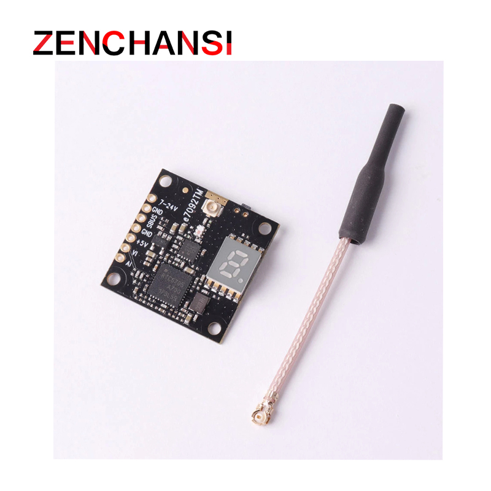
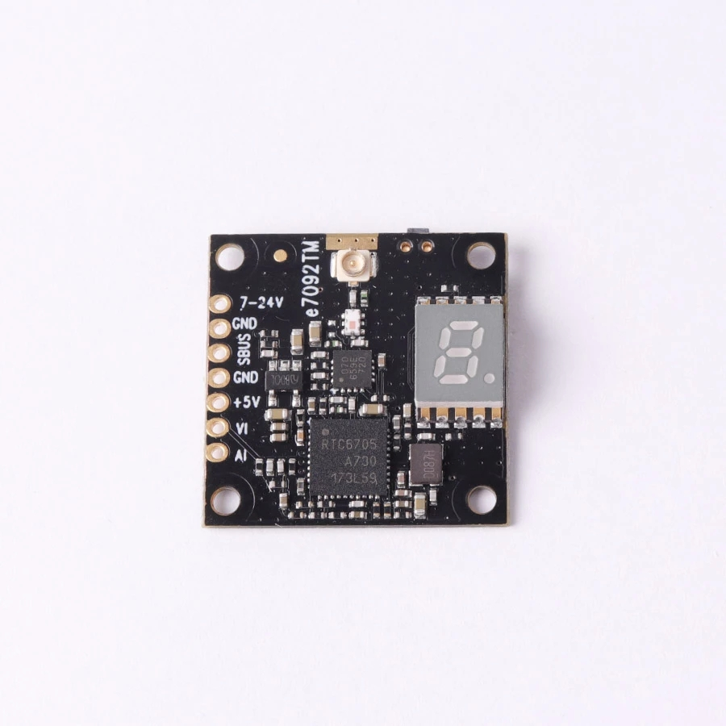
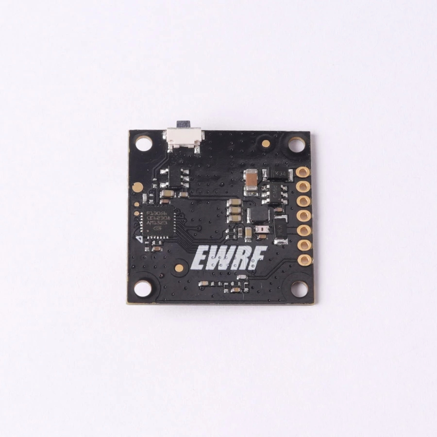

# Documentação para o VTX EWRF-e7092TM

[1(#)

[1(#)

[1(#)

## User Guide

1. Unlock & Lock

• Default status of transmitter is in lock so that the power and some channels are not selected until the transmitter is unlocked(For HAM users only).

• Press and hold the button for almost 20 seconds on power up can lock or unlock the transmitter (dot on the digital display will flares until the L or U is on when hold the button).

• When L is on the digital display for seconds after power up indicates that the transmitter is in lock status while U on the digital display indicates that it is in unlock status.

2. Setting

After power on, the digital display shows the following three parameters in turn: channel, band and power. Press and hold the button until the red dot appears on the right bottom of the digital display, which can be entered into the parameters setting.

• When the digital display shows the Arabic numerals for the channel (1-8), press the button can select the channels.

• Press and hold the button again, the digital display will shows the alphabet for band(A-b-c-d-E-F), press the button can select the bands.

• Press and hold the button again, the digital display will shows the indication for power(H:200mW、 U:100mW. L: 25mW-: OFF), press the button can select the power.

Finally, press and hold the button,the red dot on the right bottom of the digital display will disappear. VTX is back to normal working state and the channel,band,power will display in turn on the digital display.

3. SBUS/OSD setting

• When SBUS port is connected with a RC receiver, it can been used to change transmitter parameters. Make sure that there is a SBUS signal from receiver within 3 seconds after powering up,otherwise the transmitter is back to button-press setting mode. When in the setting mode of SBUS, the red dot on the digital display will glow.

### For Betaflight/Cleanflight OSD setting of power,bands,channels and Pitmode,please referring to 'EWRF 5.8G AV TX OSD Setting' for details.

Note:

IMPORTANT

1.Make sure that there is enough space for airflow when installing the module on the drone in case the overheating protection starts to reduce the power even to shut down at the worst.

2. Please install the antenna before powering up for a longer use life.

3. The maximum current of output DC 5V is 300mA.

